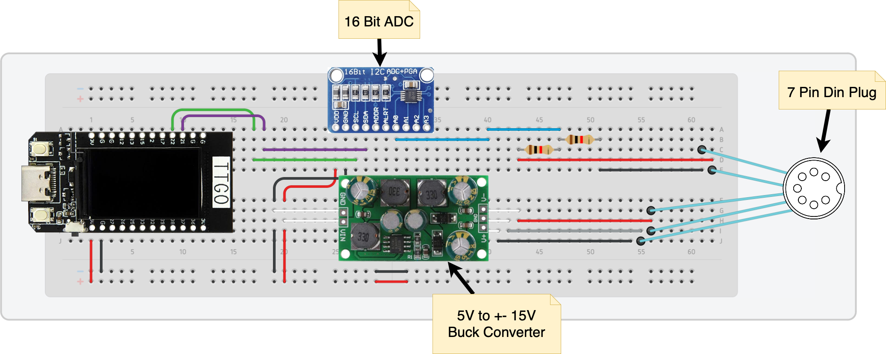

<p align="center">
    
    <h1 align="center">Open Phybox</h1>
</p>

A re-implementation of the Phybox experiment box for the classroom. The original Phybox only works with legacy operating systems such as Windows XP. This repository contains firmware for a custom ESP-based build that is compatible with the original Phybox meters, but works with modern operating systems like iPadOS.

A brief synopsis of this project and also part of a reverse engineering process of the phybox can be found [here](/documentation/synopsis/Output/PhyboxReverseEngineering.pdf).

## Repository structure

```
.
├── apps/
│   └── OpenPhyboxSwift  |  Swift iPadOS & macOS app
├── assets/              |  Assets, like icons, screenshots
├── documentation/
│   └── synopsis/        |  A short synopsis of this project in german
└── firmware/            |  Firmware code for the ESP32
```


## Firmware

The firmware for the `ESP32` is written in `C++` with the use of the Arduino framework using the `PlatformIO` toolchain.

## Hardware

By using a 7-pin DIN connector, we can connect any original Phybox meter and measure its voltage with an external ADC chip. Since the Phybox devices need an operating voltage of `±15V`, a buck converter is used to convert the `5V` coming from the ESP to the required `±15V`.

<p align="center">
    
</p>

## Parts used

- [ESP32](https://www.amazon.de/-/en/ICQUANZX-T-Display-Bluetooth-Development-Arduino/dp/B07VNG9D52/ref=sr_1_6?crid=3EY0YUT2LNZ89&keywords=esp32+usb+c&qid=1682765795&sprefix=esp32+usb+c+,aps,108&sr=8-6)
- [Buck Converter](https://www.amazon.de/-/en/Converter-Positive-Negative-Voltage-Regulator/dp/B07SK6FBB8/ref=sr_1_7?crid=2PFQT16YGPN5J&keywords=buck+wandler++-+15v&qid=1682765850&sprefix=buck+converter++-+15v,aps,153&sr=8-7&th=1)
- [ADC](https://www.amazon.de/-/en/AZDelivery-compatible-channels-Raspberry-including/dp/B07QHWLTTS/ref=sr_1_5?crid=3CAK4F7QYQPCN&keywords=16+bit+adc&qid=1682765903&sprefix=16bit+adc,aps,134&sr=8-5)
- [7-pin connector](https://www.conrad.de/de/p/rean-av-nys326-din-rundsteckverbinder-flanschbuchse-kontakte-gerade-polzahl-num-7-silber-1-st-746724.html)
